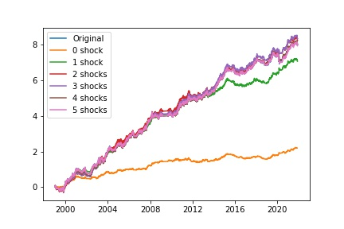

|                           | Original            | 0shocks             | 1shocks             | 2shocks             | 3shocks                     | 4shocks                     | 5shocks             |
|:--------------------------|:--------------------|:--------------------|:--------------------|:--------------------|:----------------------------|:----------------------------|:--------------------|
| Start                     | 1999-01-01 00:00:00 | 1999-01-01 00:00:00 | 1999-01-01 00:00:00 | 1999-01-01 00:00:00 | 1999-01-01 00:00:00         | 1999-01-01 00:00:00         | 1999-01-01 00:00:00 |
| End                       | 2022-01-03 00:00:00 | 2022-01-03 00:00:00 | 2022-01-03 00:00:00 | 2022-01-03 00:00:00 | 2022-01-03 00:00:00         | 2022-01-03 00:00:00         | 2022-01-03 00:00:00 |
| Duration                  | 8403 days 00:00:00  | 8403 days 00:00:00  | 8403 days 00:00:00  | 8403 days 00:00:00  | 8403 days 00:00:00          | 8403 days 00:00:00          | 8403 days 00:00:00  |
| Return (Ann.) [%]         | 35.32667686135076   | 8.644176013631188   | 30.564687271609436  | 36.4175473572119    | 36.94254049237487           | 35.34571539803775           | 35.00126225365532   |
| Volatility (Ann.) [%]     | 27.843027155132628  | 10.161830620307228  | 20.155543760277762  | 25.04794278500747   | 26.73697139724915           | 27.2938488835212            | 27.641978806703698  |
| Information Ratio         | 1.2687800311554336  | 0.8506514560828062  | 1.5164407189969171  | 1.4539137073967505  | 1.381702510112111           | 1.2950066349703395          | 1.266235767649415   |
| Final AUM [unitless]      | 3079.5871181288853  | 9.037395170390496   | 1189.6106919775048  | 3811.3122941695956  | 4220.530831124793           | 3091.1115806629437          | 2888.8835728537465  |
| AUM Peak [$]              | 3533.2213953169125  | 9.292856455330883   | 1341.6054869006412  | 4406.798691053455   | 4926.287034747564           | 3577.5145440272677          | 3320.0500459387617  |
| Final Return [%]          | 288388.1327922869   | 759.1133051779111   | 117797.69050922644  | 376741.9053764077   | 397513.0085916492           | 291042.38251346454          | 271995.14255847916  |
| Max. Drawdown [%]         | -39.74590497502732  | -24.486036576965496 | -31.037246633493254 | -25.643991343592177 | -27.779057014685606         | -39.00046363898241          | -43.45512388141833  |
| Max. Drawdown Duration    | 791 days 00:00:00   | 1796 days 00:00:00  | 884 days 00:00:00   | 578 days 00:00:00   | 577 days 00:00:00           | 640 days 00:00:00           | 791 days 00:00:00   |
| Avg. Drawdown Duration    | 169 days 15:36:00   | 295 days 08:00:00   | 148 days 12:00:00   | 158 days 04:48:00   | 155 days 02:17:08.571428572 | 162 days 13:27:48.292682926 | 169 days 15:36:00   |
| Max. Underwater Duration  | 2019 days 00:00:00  | 6173 days 00:00:00  | 668 days 00:00:00   | 1428 days 00:00:00  | 1428 days 00:00:00          | 1428 days 00:00:00          | 1428 days 00:00:00  |
| Total Underwater Duration | 6629 days 00:00:00  | 6635 days 00:00:00  | 6630 days 00:00:00  | 6631 days 00:00:00  | 6630 days 00:00:00          | 6630 days 00:00:00          | 6629 days 00:00:00  |



```plaintext
|                           | Original            | 0shocks             | 1shocks             | 2shocks             | 3shocks                     | 4shocks                     | 5shocks             |
|:--------------------------|:--------------------|:--------------------|:--------------------|:--------------------|:----------------------------|:----------------------------|:--------------------|
| Start                     | 1999-01-01 00:00:00 | 1999-01-01 00:00:00 | 1999-01-01 00:00:00 | 1999-01-01 00:00:00 | 1999-01-01 00:00:00         | 1999-01-01 00:00:00         | 1999-01-01 00:00:00 |
| End                       | 2022-01-03 00:00:00 | 2022-01-03 00:00:00 | 2022-01-03 00:00:00 | 2022-01-03 00:00:00 | 2022-01-03 00:00:00         | 2022-01-03 00:00:00         | 2022-01-03 00:00:00 |
| Duration                  | 8403 days 00:00:00  | 8403 days 00:00:00  | 8403 days 00:00:00  | 8403 days 00:00:00  | 8403 days 00:00:00          | 8403 days 00:00:00          | 8403 days 00:00:00  |
| Return (Ann.) [%]         | 35.32667686135076   | 8.644176013631188   | 30.564687271609436  | 36.4175473572119    | 36.94254049237487           | 35.34571539803775           | 35.00126225365532   |
| Volatility (Ann.) [%]     | 27.843027155132628  | 10.161830620307228  | 20.155543760277762  | 25.04794278500747   | 26.73697139724915           | 27.2938488835212            | 27.641978806703698  |
| Information Ratio         | 1.2687800311554336  | 0.8506514560828062  | 1.5164407189969171  | 1.4539137073967505  | 1.381702510112111           | 1.2950066349703395          | 1.266235767649415   |
| Final AUM [unitless]      | 3079.5871181288853  | 9.037395170390496   | 1189.6106919775048  | 3811.3122941695956  | 4220.530831124793           | 3091.1115806629437          | 2888.8835728537465  |
| AUM Peak [$]              | 3533.2213953169125  | 9.292856455330883   | 1341.6054869006412  | 4406.798691053455   | 4926.287034747564           | 3577.5145440272677          | 3320.0500459387617  |
| Final Return [%]          | 288388.1327922869   | 759.1133051779111   | 117797.69050922644  | 376741.9053764077   | 397513.0085916492           | 291042.38251346454          | 271995.14255847916  |
| Max. Drawdown [%]         | -39.74590497502732  | -24.486036576965496 | -31.037246633493254 | -25.643991343592177 | -27.779057014685606         | -39.00046363898241          | -43.45512388141833  |
| Max. Drawdown Duration    | 791 days 00:00:00   | 1796 days 00:00:00  | 884 days 00:00:00   | 578 days 00:00:00   | 577 days 00:00:00           | 640 days 00:00:00           | 791 days 00:00:00   |
| Avg. Drawdown Duration    | 169 days 15:36:00   | 295 days 08:00:00   | 148 days 12:00:00   | 158 days 04:48:00   | 155 days 02:17:08.571428572 | 162 days 13:27:48.292682926 | 169 days 15:36:00   |
| Max. Underwater Duration  | 2019 days 00:00:00  | 6173 days 00:00:00  | 668 days 00:00:00   | 1428 days 00:00:00  | 1428 days 00:00:00          | 1428 days 00:00:00          | 1428 days 00:00:00  |
| Total Underwater Duration | 6629 days 00:00:00  | 6635 days 00:00:00  | 6630 days 00:00:00  | 6631 days 00:00:00  | 6630 days 00:00:00          | 6630 days 00:00:00          | 6629 days 00:00:00  |
```